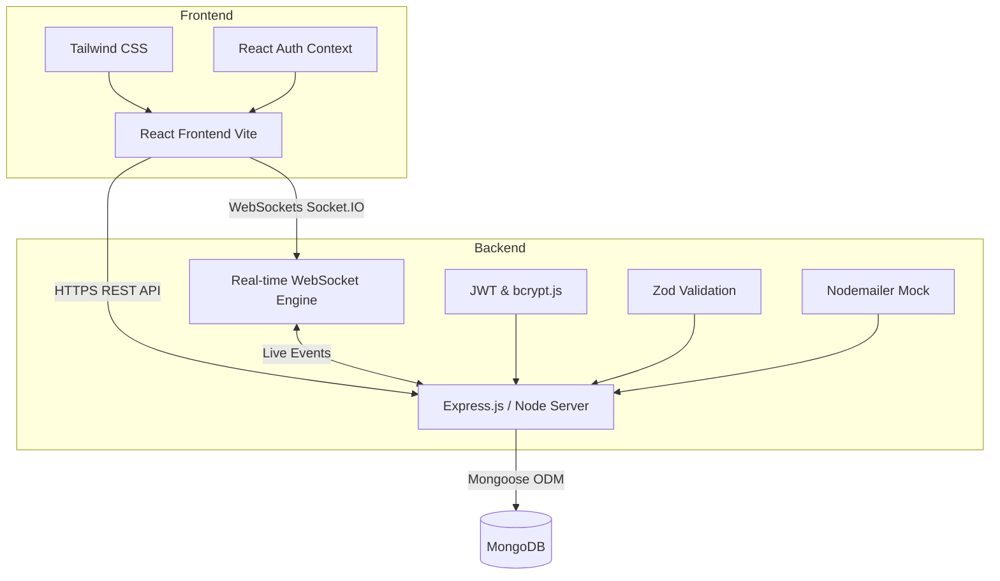
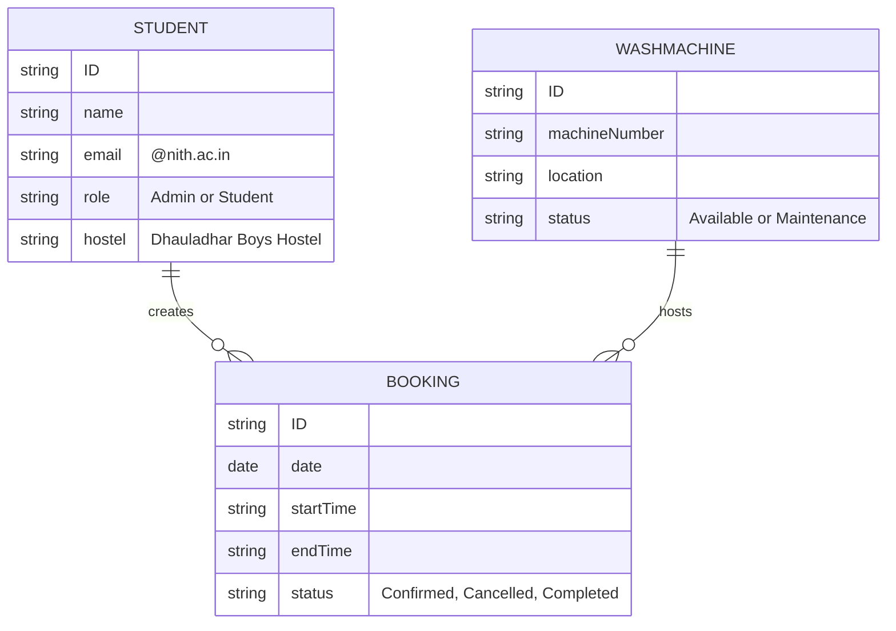

# 🧺 Dhauladhar Boys Hostel (DBH) Laundry Booking System

A robust, real-time washing machine slot booking system designed exclusively for Dhauladhar Boys Hostel at NIT Hamirpur. This platform ensures fair usage limits, eliminates scheduling conflicts, and provides an elegant interface for both students and admins.

---

## 🏗️ System Architecture

### High-Level Architectural Flow


### Entity Relationship & Core Flow


The project is built on a modern **MERN (MongoDB, Express, React, Node.js)** stack layered with **TypeScript** and **Tailwind CSS**. 

### 1. Frontend Architecture (`client/`)
- **Framework:** React 18 powered by **Vite** for lightning-fast HMR and optimized builds.
- **Language:** TypeScript for strict type-checking and autocompletion routines.
- **Styling:** **Tailwind CSS** with a custom *Glassmorphism* aesthetic featuring animated UI components.
- **State Management:** React Context API handles the global User/Admin authentication state (`AuthContext.tsx`).
- **Data Fetching:** **Axios** with interceptors injecting the JWT bearer token into every request automatically.
- **Real-Time Data:** `socket.io-client` listens to broadcasted booking creation and cancellation events, instantly refreshing grid slots if another student books the machine you are looking at.
- **Routing:** `react-router-dom` handles page rendering combined with a specialized `<ProtectedRoute>` wrapper that enforces Authentication (and Role checks).

### 2. Backend Architecture (`server/`)
- **Server:** Node.js + Express.js handling REST API routes.
- **Database:** MongoDB driven by **Mongoose** ORM mapping dynamic schemas.
- **Authentication:** Custom JWT issuance upon Login/Registration. A `protect` middleware ensures only authorized JWTs can access routes.
- **Password Hashes:** Handled by `bcrypt.js` with Salt rounds baked into the Mongoose `pre('save')` lifecycle hook.
- **Security & Hardening:**
  - `express-rate-limit`: Prevents brute-forcing endpoints (limited to 10 auth requests / 15 minutes).
  - `zod`: Parses and sanitizes input payloads efficiently directly in the router pipeline.
- **Real-Time Events:** Integrated **Socket.IO** server piggybacking directly onto the Node `http` server. 
- **Notification Engine:** Implemented Nodemailer boilerplate for confirming/canceling slots via email (currently in Mock Output mode).

---

## 🗄️ Database Schema & Models

### 1. Student Model
Handles User Accounts and Authentication.
- Enforced Email checking: Must end with `@nith.ac.in`.
- Forced Hostel lock: Hardcoded locking specifically for *Dhauladhar Boys Hostel*.
- Tracks Name, Roll Number, Room Number, and Role (`student` or `admin`).

### 2. Washing Machine Model
Handles the inventory of available hardware.
- Tracks Machine Numbers and Location Descriptions (e.g. "Ground Floor").
- Stores operational `status` (Available or Maintenance).

### 3. Booking Model
The core engine correlating Students and Machines.
- Tracks `date`, `startTime`, `endTime`, `checkInTime`.
- **Fair-Usage Implementation:** Every time a route tries to construct a booking, the Backend queries the collection to count how many records the user has between the current week's Sunday 12:00 AM and Saturday 11:59 PM. Max limit is strictly enforced at 2 slots per week.
- Checks if the targeted slot lies in the past or if there are overlaps.

---

## 🚦 Application Features

### 👨‍🎓 For Students
* **Authentication:** Create accounts tied natively to your college email.
* **Student Dashboard:** View Live Usage counters (Weekly usages resets dynamically).
* **Book a Slot:** Real-time 1-hour Slot Grid spanning from 06:00 to 22:00. Unavailable times visually fade out. Bookings enforce rules to eliminate overlaps.
* **History:** Dedicated history table permitting 1-click cancellations (30-minute cutoff prior to slot start enforced).
* **QR Handshake:** Frontend yields custom QR codes embedded with booking IDs to show during hardware usage verification.

### 👑 For Admins
* **Fleet Management (`/admin/machines`):** Track hardware statuses, declare machines under "maintenance", and deploy new ones instantly.
* **Analytics Engine (`/admin/analytics`):** Real-time aggregation of statistical data built natively with `recharts`. Visualizes pie charts of machine health, peak washing hours over a 24-hr layout, and comparative ratios.
* **Student Regulation (`/admin/students`):** See every user account on the server and manually toggle Block/Unblock statuses instantly overriding their JWT.
* **QR Check-in Simulator (`/admin/scanner`):** Verify reservations properly checking students in.

---

## 🚀 Running the App Locally

### Prerequisites
- Node.js (v18+)
- MongoDB (Running locally on `mongodb://localhost:27017` or Atlas cluster)

### 1. Set Up the Backend
```bash
cd server
npm install

# Start development server
npm run dev
```

### 2. Set Up the Frontend
```bash
cd client
npm install

# Start Vite React server
npm run dev
```

The application will be accessible at: `http://localhost:5173`
